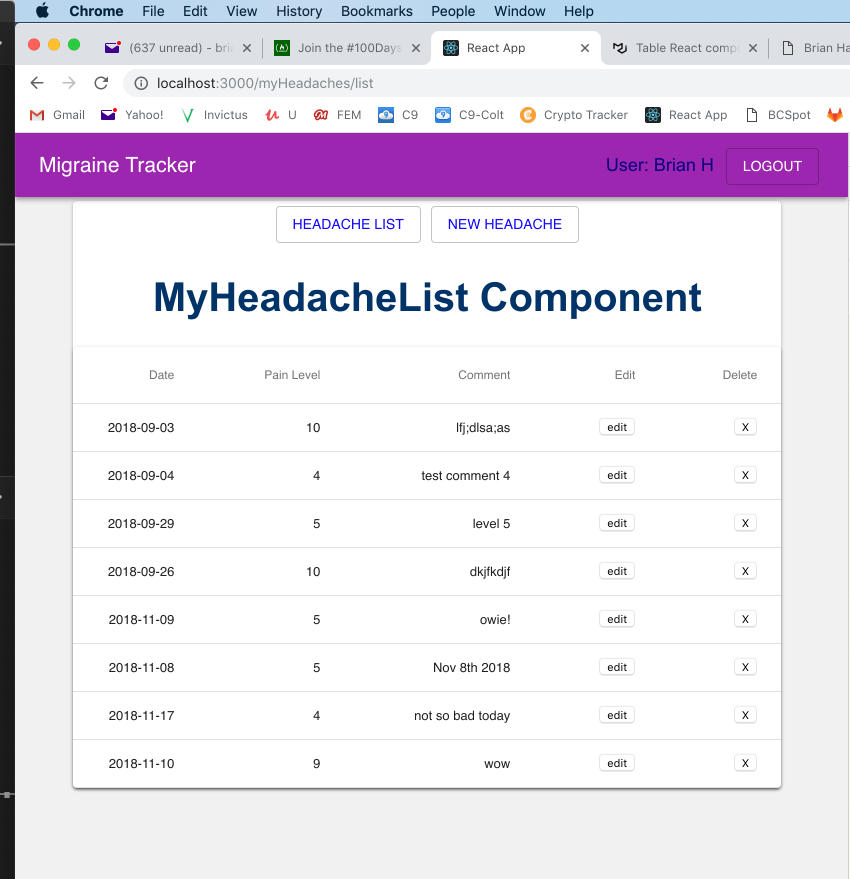

# Migraine Tracker - Client

This is a daily migraine tracker/diary to keep track of headache days, severity, and notes of triggers and medicines taken.

## URL

https://migraine-tracker-jbh.netlify.com/

More about the app...

Blog Article - <a href="https://brianhafner.info/migraine-tracker-create-frontend/" target="_blank">Migraine Tracker – Create Frontend</a>

Blog Article - <a href="https://brianhafner.info/migraine-tracker-create-backend/" target="_blank">Migraine Tracker – Create Backend</a>

Blog Article - <a href="https://brianhafner.info/migraine-tracker-deploy-backend/" target="_blank">Migraine Tracker – Deploy Backend & Frontend</a>

Background:
----------------------------------------------------
I am a migraine sufferer, and I created this app to help keep track of headaches for appointments with my Doctor.

Technology:
----------------------------------------------------
On the client side, I use React with the Material-ui design library.  

Material-ui: https://material-ui.com/

Screenshot for Migraine Tracker:
--------------------------------

